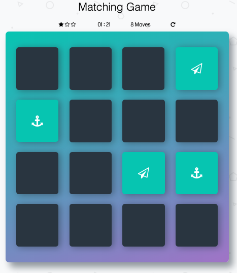

# Chingu Voyage Pre-work Project (Tier 2): Matching Game

## Overview

This game is a browser-based card matching game that presents the player with 
cards arranged in a 4x4 grid.

The back of each card is a common design shared by all cards. The front 
contains a distinctive symbol shared by one pair of cards in the deck, thus 
there are 8 unique symbols shared by 8 pairs of cards in the deck.

The objective of the Matching Game is for the player to turn over pairs of 
matching cards across eight successive turns. In a turn if the player selects 
two cards whose symbols match those cards, along with those successfully 
matched in previous turns, will remain up. However, if the player chooses 
two cards with different symbols they will both be flipped over, obscuring 
their symbols.

The game ends when all eight pairs of matching cards have been revealed. When 
this occurs a message should be displayed to let the user know they have won 
the game.

A 'New Game' Button gives the player the means to reset the game board.

## Instructions

General instructions for all Pre-Work Projects are located in the Chingu 
Voyage Handbook (URL posted in the `#read-me-first` channel on Discord). 
For detailed requirements checkout the ZenHub Board that is part of this repo.

General instructions for all Pre-Work Projects can also be found in the Chingu 
Voyage Handbook (URL posted in the #read-me-first channel on Discord).

You may use the language of your choice, Vanilla CSS/HTML/JS as well as any 
framework like Django, VueJS, Angular, React, etc.

*Structure*
- [ ] Identify the major components on the page and any sub-components within them
such as:
  - [ ] Page title or heading
  - [ ] Game board
  - [ ] New game button
- [ ] Create a prototype with the components laid out on the page using HTML & CSS

*Style*
- [ ] You may use any style you choose. However, it should be consistent (e.g.
font, font size, color scheme, layout, etc.).
  - See [Consistent Web Design](https://1stwebdesigner.com/consistent-web-design/)
  - See [Why is consistency important in Web Design?](https://laceytechsolutions.co.uk/blog/importance-of-consistency-in-web-design/)

*Functionality*
- Using JavaScript, handle game play logics based on the rules of the game.
This will involve implementing event handlers for the various user actions 
such as clicking buttons or cards on the game board.
  - [ ] Create a "New Game" button that resets the current game board to its
original state.
  - [ ] Clicking a card flips it to reveal the symbol on the reverse side
  - [ ] Card flips should be animated
  - [ ] Refer to the [Overview][#overview] above for game rules

*Other*
- [ ] Your repo needs to have a robust `README.md` (See [Keys to a Well-Written Readme](https://medium.com/chingu/keys-to-a-well-written-readme-55c53d34fe6d))
- [ ] Before submitting make sure that there are no errors in the developer console
- [ ] Anticipate and handle any edge cases. Think about what the user will see 
and how the app should handle edge cases like these:
  - [ ] What happens if the user quickly makes two consecutive clicks on a card?
  - [ ] What happens if the user clicks twice on the first card in a turn?
- [ ] The app should be responsive across multiple devices (e.g. phone, tablet, 
laptop, and desktop computers). For more information see 
[Responsive Web Design Basics](https://developers.google.com/web/fundamentals/design-and-ux/responsive/)

**Extras (Not Required)**
- [ ] Add a star rating

  From 1 to 3 stars are displayed to provide the player with a visual 
  indication of his or her performance. Three stars are displayed at the start 
  of the first turn and will be decremented by one star when the player fails 
  to match cards in a turn. A star will be added when a turn is "won", but at 
  any point in time a minimum of 0 stars and a maximum of 3 stars will be 
  displayed.

- [ ] Add a game timer 
  - [ ] Display the number of minutes and seconds that have elapsed since the
  first turn of game play. 
  - [ ] The timer is stopped when the player wins the game.
  - [ ] The timer is reset when the "New game" button is clicked
- [ ] Add a move counter
  - [ ] Displays the number of turns the player has taken, starting with one 
  at the first turn.
  - [ ] The move counter is reset when the "New game" button is clicked
- [ ] Use as FEW external packages and libraries as possible to reduce the 
number of dependencies.
- [ ] Include tests cases using tools like Jest, Enzyme, etc.
- [ ] Use Accessibility techniques (i.e. a11ly) to improve your site for users 
with impairments (see [A11Y Project](https://a11yproject.com/))
- [ ] Add a `CONTRIBUTING.md` file with instructions on how to contribute to
your project
