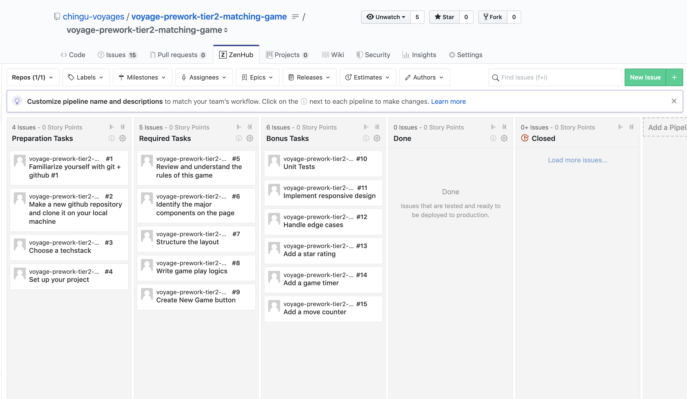

# Chingu Voyage Pre-work Project (Tier 2): Matching Game

## Overview

This game is a browser-based card matching game that presents the player with cards arranged in a 4x4 grid.

The back of each card is a common design shared by all cards. The front contains a distinctive symbol shared by one pair of cards in the deck, thus there are 8 unique symbols shared by 8 pairs of cards in the deck.

The objective of the Matching Game is for the player to turn over pairs of matching cards across eight successive turns. In a turn if the player selects two cards whose symbols match those cards, along with those successfully matched in previous turns, will remain up. However, if the player chooses two cards with different symbols they will both be flipped over, obscuring their symbols.

The game ends when all eight pairs of matching cards have been revealed. When this occurs a message should be displayed to let the user know they have won the game.

A 'New Game' Button gives the player the means to reset the game board.

## Instructions

General instructions for all Pre-Work Projects are located in the Chingu Voyage Handbook (URL posted in the
`#read-me-first` channel on Discord). For detailed requirements checkout the ZenHub Board that is part of this repo.

To see the ZenHub tab on the GitHub repo webpage requires that you install ZenHub's browser extension. For more
information visit the [ZenHub Browser Extension page](https://www.zenhub.com/extension) and these 
[installation instructions](https://t.ly/3v8w).

If you would like to add these tasks to your repo so you can track the progress of your Solo Project and so they will be more readily available for reference, you will need to manually add new issues to your ZenHub board and copy/paste the text in our issues to yours.

Good Luck!!!